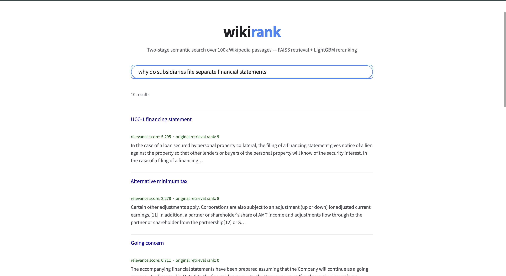
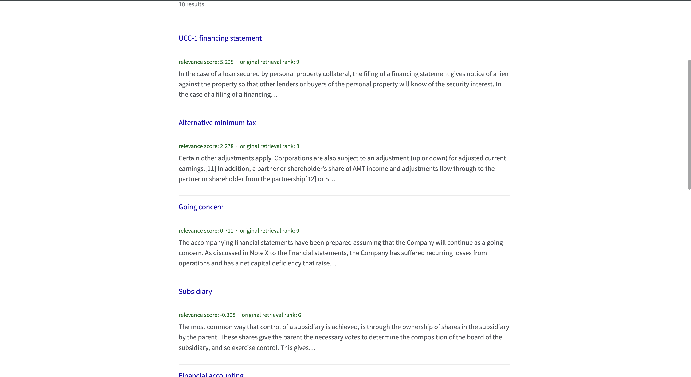
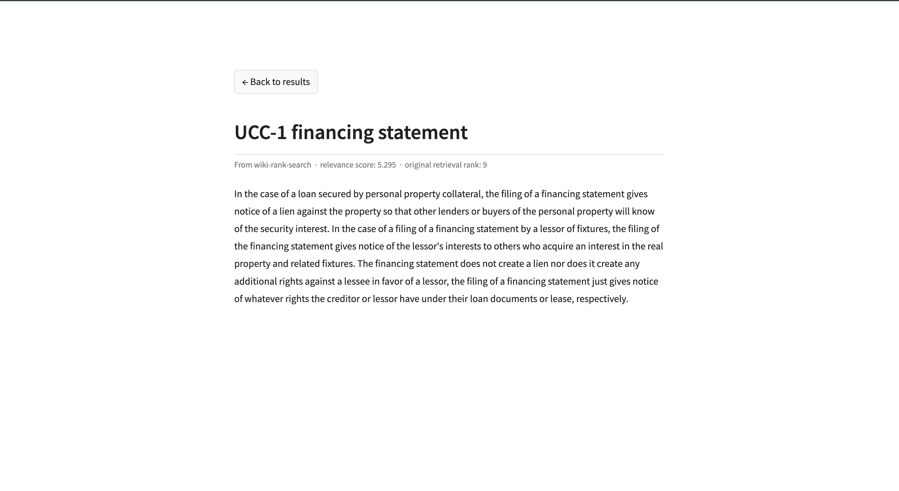

# wiki-rank-search

**Two-stage semantic search over 100k Wikipedia passages- FAISS dense retrieval + LightGBM learning-to-rank reranking.**

## Overview

Most simple search systems stop at retrieval: embed a query, find the nearest passages by vector similarity, done. This project goes a step further, mirroring how production search systems (Google, Amazon, LinkedIn) actually work. A fast retrieval stage casts a wide net using dense embeddings, and a "Learned Ranking" stage reorders those candidates using a model trained on real human relevance judgments, not just raw distance.

The system:
1. Embeds Wikipedia passages and indexes them with FAISS for fast approximate nearest-neighbor search
2. Retrieves top-k candidates for any natural-language query
3. Reranks those candidates using a LightGBM model (`LGBMRanker`, LambdaRank objective) trained on real relevance labels from Google's Natural Questions dataset (via the BEIR benchmark)
4. Serves the results as per the retrieval.

## Architecture

Query
│
▼
┌─────────────────────┐
│ Stage 1: Retrieval │ fastembed (BAAI/bge-small-en-v1.5) → 384-dim vector
│ (FAISS, IndexFlatL2)│ → top-k nearest passages by embedding distance
└─────────┬────────────┘
│ candidates (unranked by relevance, ranked by raw distance)
▼
┌─────────────────────┐
│ Stage 2: Reranking │ 4 features per (query, passage) pair:
│ (LightGBM LambdaRank)│ embedding similarity · TF-IDF similarity ·
└─────────┬────────────┘ passage length · original retrieval rank
│
▼
Final ranked results


**Why two stages, not one?** Retrieval alone (embedding similarity) is fast but coarse — it finds passages that are topically similar, not necessarily the correct answer. Reranking is precise but too expensive to run over an entire corpus, so it only evaluates the retrieval stage's shortlist. This retrieve-cheap, rerank-precisely split is the same pattern real-world search systems use at scale.

**Why raw FAISS, not a vector database (e.g. ChromaDB)?** The corpus is a static snapshot, built once, queried repeatedly, no concurrent writes, no live updates, no metadata filtering. A vector database's extra machinery (transactions, persistence layer, update/delete support) solves problems this project doesn't have, so it would be pure overhead here.

## What Each File Does

**Pipeline (`src/`)**
- `data_prep.py` — Builds the 100k-passage corpus, guaranteeing every qrels-referenced passage is included, then padding with random passages to reach the target size.
- `embed_corpus.py` — Embeds all passages into 384-dim vectors using fastembed, batched to avoid memory pressure on limited RAM.
- `build_index.py` — Builds a FAISS `IndexFlatL2` index from the embeddings and saves it to disk.
- `retrieve.py` — Given a query, embeds it and searches the FAISS index for the top-k nearest passages.
- `prepare_labels.py` — Builds the labeled training set: real positives from qrels, plus hard negatives (FAISS-retrieved candidates that weren't confirmed relevant), each with its genuine FAISS retrieval rank.
- `fit_and_save_vectorizer.py` — Fits TF-IDF on the full corpus once and saves it, so it never needs refitting at runtime.
- `features.py` — Computes the 4 ranking features (embedding similarity, TF-IDF similarity, passage length, retrieval rank) for every (query, passage) pair.
- `lgbm_ranker.py` — Trains the `LGBMRanker` (LambdaRank objective) on the labeled feature table and saves the model.
- `rank.py` — The full production pipeline: retrieve candidates, compute their features, score them with the trained ranker, return the reordered results.
- `evaluate.py` — Splits queries into train/test sets, retrains on train only, and computes MRR on held-out test queries.

**Orchestration**
- `main.py` — Runs the full pipeline end to end (data → embed → index → labels → features → train), skipping any step whose output already exists on disk — makes the project fully reproducible from a fresh clone.

## Demo

A local Streamlit interface, styled like a search engine — search results are ranked by the trained model's score, with the original FAISS retrieval rank shown alongside for comparison, and clicking a result opens a full Wikipedia-style article view.

**Search page**



**Reranking in action** — notice results aren't ordered by "original retrieval rank"; the reranker has reordered candidates based on learned relevance, not just embedding distance.



**Article view** — clicking a result opens the full passage.



*Note: the demo runs locally only and is not deployed publicly — it exists to showcase the working pipeline, not as a hosted product.*

## Evaluation

The reranker was evaluated using Mean Reciprocal Rank (MRR) on a proper train/test split — queries (not just rows) were split 80/20, the ranker was retrained on the training queries only, and MRR was computed on the held-out test queries it never saw during training. Full methodology, including a real overfitting bug that was found and fixed mid-evaluation, is documented in [`Evaluation/methodology.md`](Evaluation/methodology.md).

| Metric | Value |
|---|---|
| Overall MRR | **0.9006** |
| Easy queries (retrieval already ranked the answer #1) — 389 queries | 0.9746 |
| Hard queries (retrieval didn't rank the answer #1) — 302 queries | 0.8052 |

The easy/hard split matters: on the 302 genuinely hard queries — where FAISS's raw retrieval either misranked or completely missed the correct passage from its top-10 — the reranker still recovers the correct answer with an MRR of 0.81. This is the real evidence that reranking adds value beyond what retrieval alone achieves, rather than just riding on cases retrieval had already solved.

Full per-query results are saved in [`Evaluation/evaluation.json`](Evaluation/evaluation.json). Due to local hardware constraints (8GB RAM insufficient for the repeated live FAISS calls this evaluation required), label regeneration, training, and evaluation for this final run were completed on Google Colab rather than locally — see the methodology doc for details.

**A note on the numbers:** an MRR around 0.90 is high for a genuinely hard, generalizing ranking problem, and it's worth being upfront about why. The evaluation set here is relatively small (3,452 queries, ~6 candidates per query) due to hardware constraints — training and evaluating at a larger scale was not feasible on the available machine. At a larger corpus and query scale, I'd expect these numbers to settle lower and more realistic — the current results should be read as a positive signal on a constrained setup, not a claim of state-of-the-art ranking quality.


## Key Engineering Decisions

**Qrels-first corpus construction.** An early version built the corpus via arbitrary slicing (`corpus[:N]`), which only matched 111 of 4,201 qrels — nowhere near enough labeled signal to train on. The corpus is now built by including every qrels-referenced passage first, then padding to the target size, guaranteeing full label coverage.

**Hard negatives via FAISS, not random sampling.** Negative examples are drawn from FAISS's own top-10 retrieved candidates (excluding confirmed positives), not random passages. Random negatives are trivially easy to distinguish; hard negatives — passages that "look" relevant but aren't, force the model to learn real distinctions rather than an easy shortcut.

**Found and fixed a real overfitting bug.** The `retrieval_rank` feature was initially hardcoded to `0` for every positive example (since positives come from qrels, not live search). This let the model achieve a suspicious MRR of 1.0 on training data₹. Fixed by running every positive through real FAISS search and using its actual retrieval rank (or a "not found" marker if it wasn't in the top-k at all).

**Raw FAISS over a vector database.** The corpus is a static, build-once snapshot with no concurrent writes or metadata filtering and using a vector database's extra machinery would be pure overhead here.

## Setup & Usage

**1. Clone and set up the environment**
```bash
git clone https://github.com/Lehel721/search-rank
cd search-rank
python -m venv myenv
source myenv/bin/activate
pip install -r requirements.txt
```

**2. Run the full pipeline**
```bash
python main.py
```
This runs every stage in order — corpus construction, embedding, indexing, TF-IDF fitting, label preparation, feature engineering, and training, skipping any step whose output already exists, so it's safe to re-run after an interruption.

**3. Try a search**
```bash
python src/rank.py
```

*Note: the Streamlit demo app and evaluation script used during development are not included in this repo. Demo screenshots are below; evaluation methodology and results are documented in the [Evaluation](#evaluation) section.*